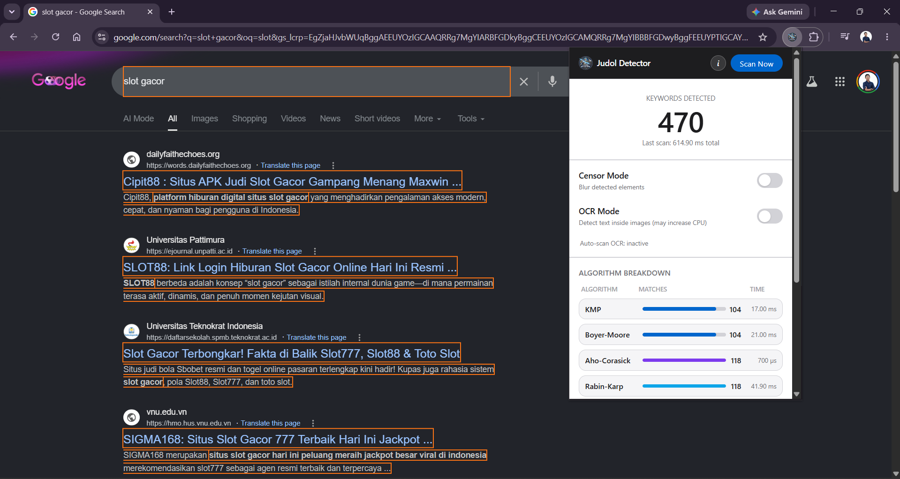

# Judol Detector



Judol Detector is a TypeScript-based Chromium browser extension for detecting online gambling content on web pages. It performs exact matching, regex, fuzzy matching, DOM highlighting, tooltips, real-time statistics popup, text blur, and OCR on images.

## Features

- Exact matching detection using KMP and Boyer-Moore from `keywords/keywords.txt`.
- Common pattern detection `<word><number>` using RegEx.
- Manipulative or visually similar character detection using weighted Levenshtein distance.
- Bonus engines: Aho-Corasick and Rabin-Karp.
- DOM element highlighting for detected content without breaking layout.
- Custom tooltip on hover for detected elements.
- Real-time statistics popup showing match count and algorithm execution time.
- Text blur toggle to obscure detected content.
- OCR on images to detect gambling text hidden inside image elements.

## Project Structure

```text
judol-detector/
├── public/
│   ├── manifest.json
│   └── images/
├── src/
│   ├── algorithms/
│   ├── background/
│   ├── content/
│   ├── popup/
│   ├── styles/
│   └── types/
├── keywords/
│   └── keywords.txt
├── test/
│   └── image/
├── doc/
└── spesifikasi/
```

## Brief Explanation of KMP and Boyer-Moore

### KMP

KMP performs string matching by leveraging a failure function (prefix table). On a mismatch, the algorithm does not restart from the beginning — instead, it jumps to the longest relevant prefix. This implementation is built from scratch and manually tracks the number of comparisons.

### Boyer-Moore

Boyer-Moore matches the pattern from right to left and uses two main heuristics: bad character via a last occurrence table, and good suffix via a border/good suffix table. On a mismatch, the pattern is shifted as far as possible based on these two heuristics. This implementation is also built from scratch with manual comparison counting.

## Requirements

- Node.js 18 or later.
- npm.
- A Chromium-based browser such as Google Chrome or Microsoft Edge.

## Installation

```bash
npm install
```

## Build

```bash
npm run build
```

The build output will be saved in the `dist/` folder.

## Loading the Extension in Chrome

1. Open `chrome://extensions/`.
2. Enable **Developer mode**.
3. Click **Load unpacked**.
4. Select the `dist/` folder from this project.
5. Open a target web page, then use the extension popup to start scanning.

## How to Contribute

1. Create a new branch for the changes you want to work on.
2. Run `npm install` if dependencies are not yet installed.
3. Make your changes while following the existing code structure.
4. Ensure the project builds successfully with `npm run build`.
5. If relevant, run `npm run typecheck` before opening a pull request.
6. Submit a pull request with a clear summary of your changes.

## Authors

| Name                        | Student ID |
|-----------------------------|------------|
| Vincent Rionarlie           | 13524031   |
| Jason Edward Salim          | 13524034   |
| Muhammad Aufar Rizqi Kusuma | 13524061   |

## License

This project is licensed under the MIT License. See [LICENSE](LICENSE) for the full text.